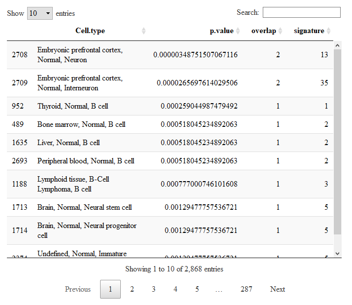

# **CellMarker Enrichment**

*CellMarker Enrichment* is a simple and fast enrichment tool to discover the putative cell types of your single cell dataset. It makes used of the largest database of single cell markers created by [Xinxin Zhang et al.](https://academic.oup.com/nar/article/47/D1/D721/5115823) which contains 13605 cell markers of 467 cell types in 158 human tissues/sub-tissues and 9148 cell makers of 389 cell types in 81 mouse tissues/sub-tissues.

To run CMenrich simply pass as input your list of markers, which can be the ones inferred from the analysis of your single cell dataset, and soecify the species (human or mouse).

```{r}
results=CMenrich(gene.list=c('NEUROD1','ARX','CD79A'),species='human')
``` 

results$enrichments is a data.frame conntaining the resulting enrichments. We can visualize it with the DT package.

```{r}
DT::datatable(results$enrichments)
``` 


Here you can see the best putative cell types/subtypes ranked from the best hit to the worst hit.
At the top we have Neurons from the Embryonic cortex, whose highly curated marker set of 13 genes has a singificant overlap with our dummy list of three genes (2/3, p<0.000003).
If you want to check which ones are the two genes of the overlap simply run

```{r}
results$genes[[1]]
``` 
which displays the common genes of the 1st hit. (Then results$genes[[i]] for the i-th hit)

```{r}
[1] "NEUROD1" "ARX"
``` 
